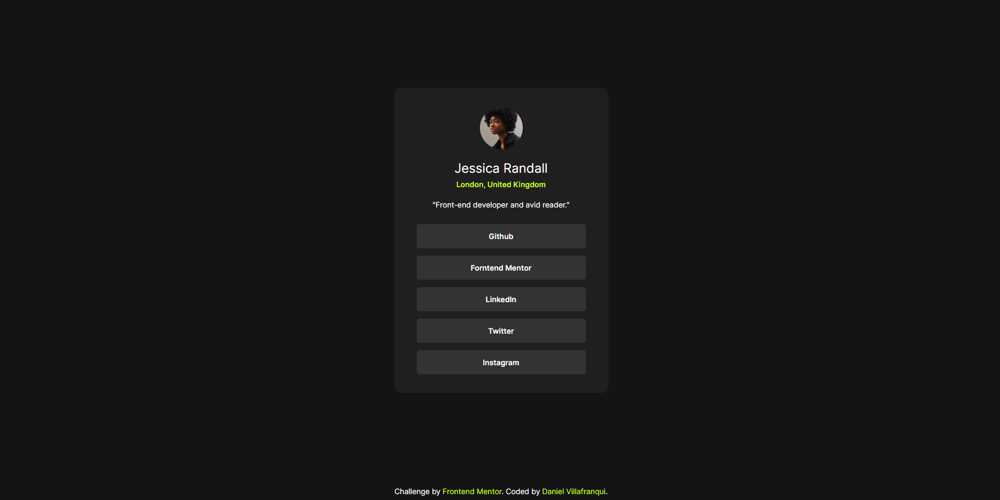

# Frontend Mentor - Social links profile solution

This is a solution to the [Social links profile challenge on Frontend Mentor](https://www.frontendmentor.io/challenges/social-links-profile-UG32l9m6dQ). Frontend Mentor challenges help you improve your coding skills by building realistic projects. 

## Screenshot

## URL

- Live Site URL: [https://dan-vc.github.io/FrontEnd-Mentor-Social-Links/](https://dan-vc.github.io/FrontEnd-Mentor-Social-Links/))

## Author

- Website - [Daniel Villafranqui] [https://dan-vc.github.io/Proyecto-Pagina-Web-Personal/](https://dan-vc.github.io/Proyecto-Pagina-Web-Personal/)
- Frontend Mentor - [@dan-vc] [https://www.frontendmentor.io/profile/dan-vc](https://www.frontendmentor.io/profile/dan-vc)
